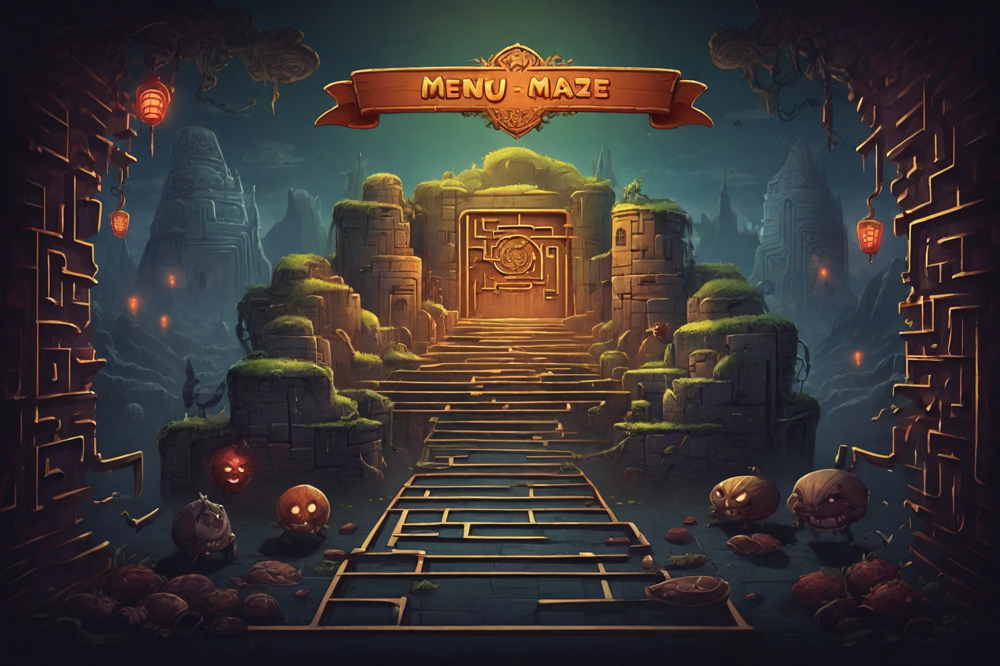
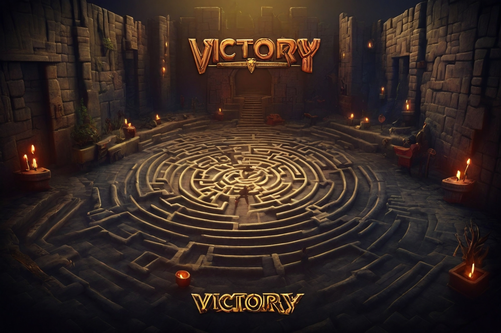
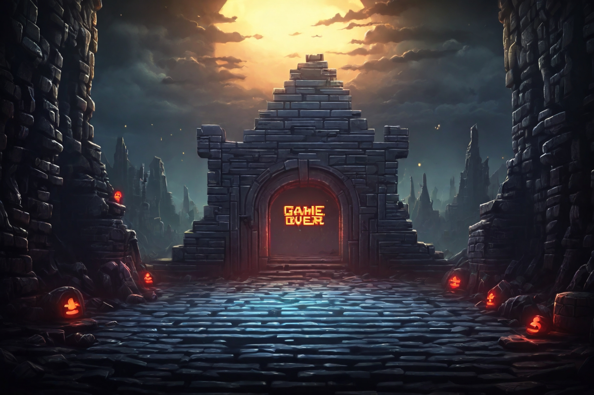

# Maze Runner Game

Maze Runner Game is a project developed for the Fundamentals of Programming course at the Technical University of Munich by Maze Minds (Gift and Wassim).

## Overview

Maze Runner Game is an action-packed game where the main character, referred to as the hero, races through a maze to collect all the keys before being captured by a ghost.

## Controls

- **Arrow keys (Up, Down, Left, Right):** Move the hero.

  
## Characters
- ** Movable Character :**
  - an abstract class that represents parent class for the entities of the maze .
  - 
- **Player :**
  - The main character of the game.
  - The player controls the hero.
  - The hero has lives.
  - The hero can move in 4 directions: up, down, left, right.
  - The hero can collect keys.
  - The hero can be captured by a ghost.
- **Enemy :**
  - The ghost is the enemy of the hero.

-
## Screens
- **Menu screen:**
  - Press "Go to game" button: Start the game.
  - Press "Instructions" button: Go to instructions screen.
  - 
  - 
  - Press `esc` key: Exit the game.
- **Level screen:**
  - Press "Go to Levels" button: Start the game at the chosen level.
  - Press 'back' button: Go back to the menu screen.
- **Instructions Screen :**
  - Give you the controls of the game.
  - Guide you through the game.
- **Victory Screen :**
  - Show when  the hero wins the game.
    
  - Press 'Go To Menu' button: Go back to the menu screen.

- **Game Over Screen :**
  - Show when  the hero loses the game.
  - Press 'Go To Menu' button: Go back to the menu screen.
    
## HUD
- **Score :**
  - Show the number of keys collected.
  - Show the number of lives left.
  
## Setup

To run the game, make sure you have the following dependencies:

- **Java 11**
- **Gradle Wrapper 8.4**
- **LibGDX 1.9.13:** [LibGDX GitHub](https://github.com/libgdx/libgdx)
- **GDX Liftoff 1.9.13:** [GDX Liftoff GitHub](https://github.com/tommyettinger/gdx-liftoff)

